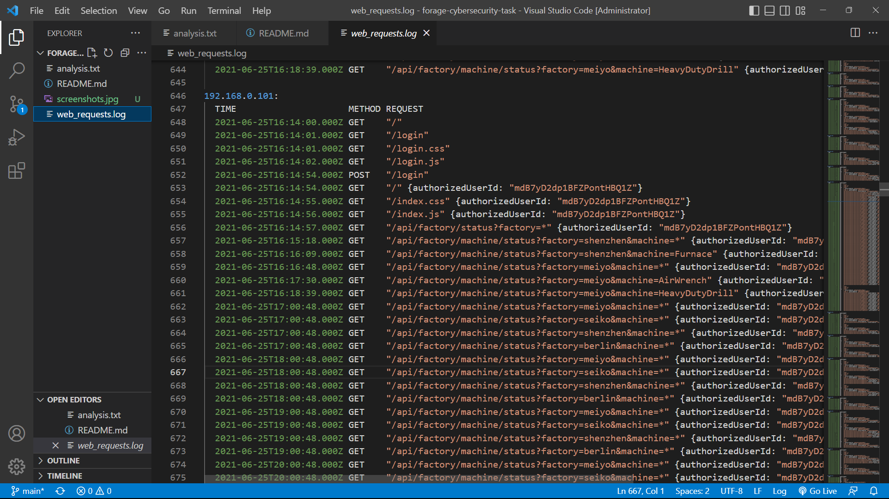

# Forage Cybersecurity Virtual Experience

## 📌 Project Overview
This project is part of a cybersecurity virtual internship where I analyzed web server logs to detect suspicious activity and potential security threats within an internal system.

---

## 🔍 What I Did
- Analyzed multiple IP address sessions from log data  
- Compared normal vs abnormal request patterns  
- Identified unusual API usage behavior  
- Detected automated requests occurring at fixed time intervals  
- Traced suspicious activity to a specific internal user  

---

## 🚨 Key Finding
- **Suspicious IP:** 192.168.0.101  
- **User ID:** mdB7yD2dp1BFZPontHBQ1Z  
- **Reason:** API requests were made at exact fixed time intervals (every hour at the same second), indicating automated script behavior rather than human activity  

---

## 🛠️ Tools Used
- VS Code  
- Git & GitHub  

---

## 📂 Files in this Project
- `web_requests.log` → Raw log data  
- `analysis.txt` → Investigation and findings  
- `README.md` → Project documentation  

---

## 📸 Screenshots

### Log File Analysis

### Analysis Output

### GitHub Repository

---

## ✅ Conclusion
The suspicious activity originated from within the internal network and was caused by automated API requests using valid credentials. This suggests possible misuse or compromise of a user account.

---

## 💡 Key Learning
This project helped me understand how cybersecurity analysts:
- Analyze log data to detect anomalies  
- Identify patterns of automated or malicious behavior  
- Investigate internal threats using structured data  